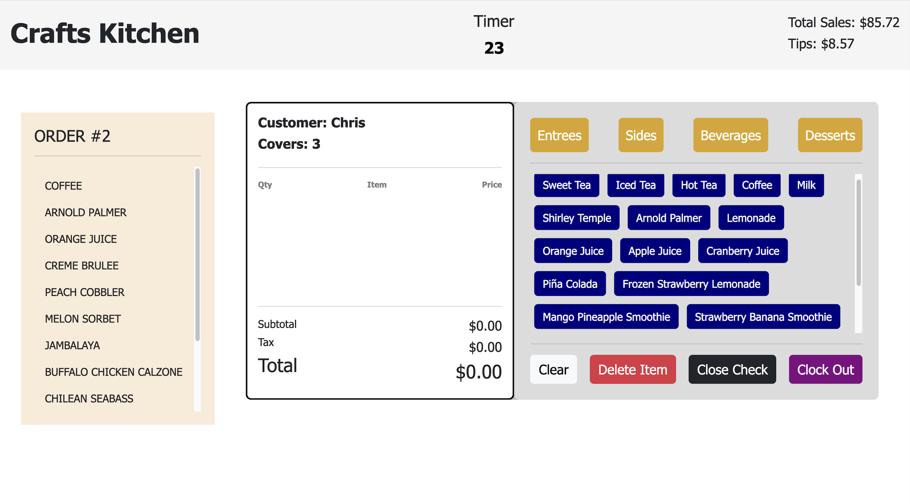
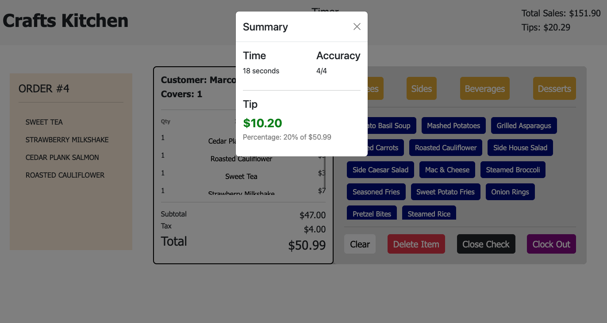
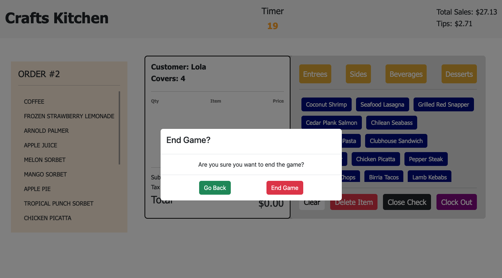

# POS Simulation Game

A restaurant Point-of-Sales simulation that generates a random order ticket for you to punch in and submit before the timer runs. The reward is a tip based on accuracy and how long you took.



### My Inspiration
If you've ever worked in the food service industry, you know how nerve wracking it is to ring in an order during a rush. I wanted to pay homage to my past job as I embark on the journey as a Software Engineer, and challenge myself to recreate a POS system, a piece of technology I interacted with everyday.

I added a little spin to it by turning it into a game, so it doesnt have all of the features a full sysyem does, but the beauty of coding is that I can always add on to my projects!


## Installation
#### Set Up Virtual Environment
```python3 -m venv .venv```

```source .venv/bin/activate```
#### Install Dependencies

```npm install```

```pip install -r server/requirements.txt```


#### Start the App
```npm start```

##
### Close Check


### End Game 
